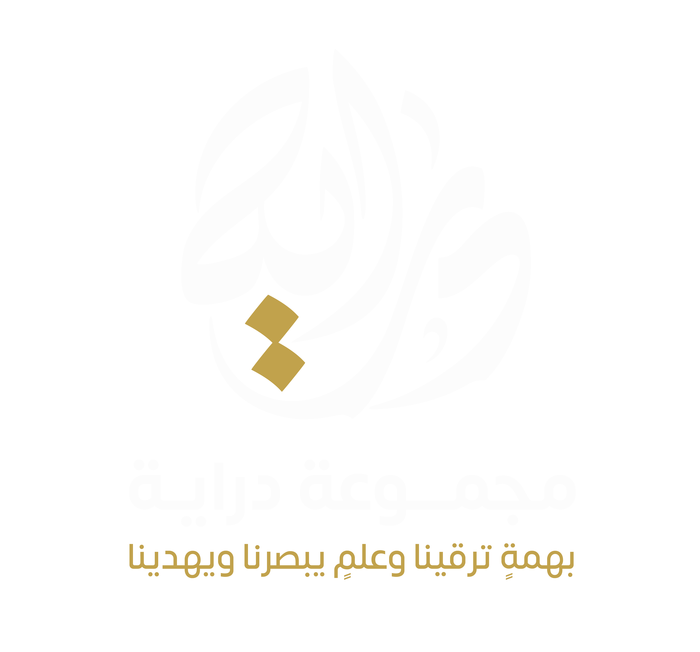

# 7rofDrayah
لعبة خلية الحروف نسخة دراية
<!DOCTYPE html>
<html lang="ar" dir="rtl">
<head>
<meta charset="UTF-8" />
<meta name="viewport" content="width=device-width, initial-scale=1.0" />
<title>خلية الحروف | مجموعة دراية</title>

</head>

<body>

  

  

    

      <button class="btn" onclick="toggleTheme()">ليلي / نهاري</button>
      <button class="btn" onclick="toggleFullscreen()">شاشة كاملة</button>
    

    

      <select id="minutes"></select>
      دقيقة
      <select id="seconds"></select>
      ثانية
      <button class="btn" onclick="startTimer()">تشغيل</button>
      <button class="btn" onclick="pauseTimer()">إيقاف</button>
    

  

  
00:30

  

    

    <svg id="svgBoard" viewBox="0 0 780 580"></svg>
  

  <button class="btn" id="resetBtn" onclick="confirmReset()">إعادة اللعبة</button>

  

    <h2>إعداد الفرق</h2>

    

      

        <label>فريق فوق ↕ تحت</label>
        <input id="teamTBName" value="الفريق الأزرق">
        

      

      

        <label>فريق يمين ↔ يسار</label>
        <input id="teamLRName" value="الفريق البرتقالي">
        

      

    

     
    <button class="btn" onclick="startGame()">بدء اللعبة</button>
  

  

    <h2>طريقة الفوز</h2>
    

    <button class="btn" onclick="closeRules()">فهمت</button>
  

  

    <h2>🎉 انتهت المسابقة 🎉</h2>
    

    <button class="btn" onclick="resetGame()">لعبة جديدة</button>
  

</body>
</html>
